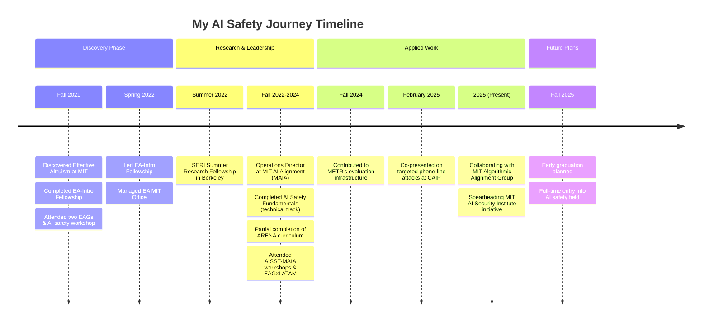

## 00 Overview

## 01 Philosophical Beginnings

### 01.01 Discovery and Introduction (Fall 2021)

My AI safety journey began at MIT in 2021 when I discovered Effective Altruism[^1] as a freshman seeking career direction. I quickly immersed myself in popular EA/AIS literature[^2] and community engagement through the EA-Intro Fellowship, two EAGs, and an AI safety workshop. During this period, I wrote [an article on Transformative AI](./transformative-ai.md) to solidify some of my fundamental thoughts on AI for a general audience.

### 01.02 Community Leadership (Spring 2022)

In Spring 2022, I transitioned to a leadership role within EA MIT (now [Impact@MIT](https://impactclub.mit.edu/)), running MIT's [EA Intro Fellowship](https://www.effectivealtruism.org/virtual-programs/introductory-program), and managing our office space in the MIT Student Center.

## 02 Zooming in on AI Risks

### 02.01 SERI Summer Research Fellowship (Summer 2022)

Summer 2022 marked my formal research entry through the (now discontinued) SERI Summer Research Fellowship in Berkeley, CA. During this intensive program, I worked under [Stephen Casper](https://stephencasper.com/) from [MIT Algorithmic Alignment Group](https://algorithmicalignment.csail.mit.edu/)[^3] developing RL fine-tuning techniques for GPT-2 to autonomously identify diverse prompts resulting in harmful model outputs (violence, disinformation, etc.) resulting in the paper [Explore, Establish, Exploit: Red Teaming Language Models from Scratch](./explore-establish-exploit.md).

### 02.02 MAIA Operations Director (Fall 2022-Spring 2023)

From Fall 2022, I served as Operations Director on [MIT AI Alignment's (MAIA)](https://aialignment.mit.edu) executive board, managing organizational strategy, communications infrastructure, and technical problem-solving—occasionally extending to resolving high-stakes administrative issues among members.

### 02.03 Technical Growth and Network Building (2023)

During 2023, I completed [AI Safety Fundamentals (technical track)](https://aialignment.mit.edu/getinvolved/) and about one week of the [ARENA curriculum](https://www.arena.education/chapter0). I also attended specialized workshops (two [AISST-MAIA technical workshops, one policy-focused](https://aialignment.mit.edu/getinvolved/), and another hosted in Constellation for university group organizers) and conferences (EAGxLATAM and others).

Throughout this period, I continuously developed perspectives on AI safety strategy and philosophical/social concerns in light of a radical future, influenced by my work, readings, and interactions with the wider AI safety community.

<!-- ### 03.03 Tools Development (2023-2024) -->

<!-- Throughout my tenure at MAIA, I developed [MopMan](https://mitalignment.notion.site/MopMan-Documentation-9bbc80b1f07744458712211f4817dfc1?pvs=74), an operations management system with AirTable API integration, and [GatPack](https://github.com/GatlenCulp/gatpack), a Python package for automating common tasks in AI safety research and operations. These tools helped save approximately 7 hours per week across multiple AI safety organizations. -->

<!-- ### 03.04 Philosophical Development (2022-2024) -->

## 03 Applied AI Safety Work

### 03.01 METR Evaluation Infrastructure (Fall 2024)

In Fall 2024, I transitioned to more applied work, contributing to [METR's](https://metr.org/) evaluation infrastructure as a contractor. My work involved developing CLI tools, evaluation templates, and [installers](https://github.com/GatlenCulp/homebrew-vivaria/)[^4] for [Vivaria](https://vivaria.metr.org/), a platform used to conduct AI capability and risk evaluations in partnership with OpenAI, Anthropic, and US/UK AI safety institutes. I also created the to improve accessibility.

### 03.02 Policy Engagements (Winter 2024-2025)

In February 2025, I co-presented on a targeted phone-line attacks demo at [Congressional Exhibition on Advanced AI](https://aialignment.mit.edu/initiatives/caip-exhibition/) (hosted by the [Center for AI Policy or CAIP](https://www.centeraipolicy.org/), supported by [Congressman Bill Foster of Illinois](https://foster.house.gov/)) to showcase the potential risks of AI misuse to congressional staffers.

### 03.03 Current Projects (Spring 2025)

Currently, I'm collaborating with the MIT Algorithmic Alignment Group on evaluations for AI R&D automation capabilities. I'm also spearheading efforts with MIT Faculty to establish a formal MIT AI Security Institute while maintaining active involvement with MAIA.

## 04 Near-Term Plans

For the past three+ years, my career has focused on mitigating risks from advanced AI, with my current emphasis on technical governance and policy work. I plan to graduate a semester early (Fall 2025) from [MIT](https://mit.edu) with a BS in Computer Science with a concentration in AI & Decision Making to fully enter this field.

Looking beyond graduation, I aim to continue working at the intersection of technical AI safety research and policy development, helping to build robust governance frameworks for increasingly capable AI systems.

[^1]: Most know EA as a fringe philosophical movement affiliated with what I believe is the largest case of crypto fraud as of April 2025. My historical relationship with EA is complex and I don't interact with the community much. I intend to write about this eventually.
[^2]: Initially: [The Precipice](book-reviews/precipice.md) (via Harvard's Reading Group), [Doing Good Better](book-reviews/doing-good-better.md), [Human Compatible](book-reviews/human-compatible.md), [Superintelligence](book-reviews/superintelligence.md), numerous AIS/LW articles. Later expanded to include The Sequences, Joe Carlsmith's "Otherness and control in the age of AGI", [Uncontrollable](book-reviews/uncontrollable.md), Superforecasting, Life 3.0, and others.
[^3]: Ironically going from MIT to Berkeley and joining a research project with someone at MIT 💀
[^4]: The team had no desire to maintain the Homebrew Formula unfortunately. Some parts of it lived on elsewhere but the project overall was scrapped.