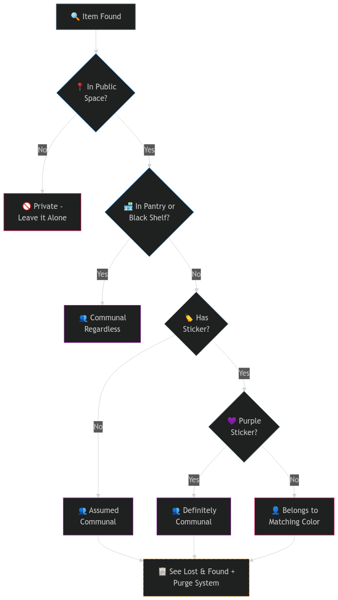
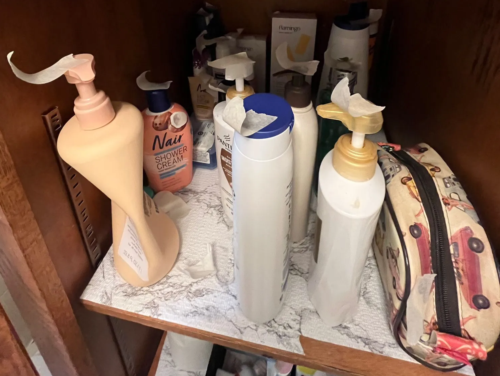
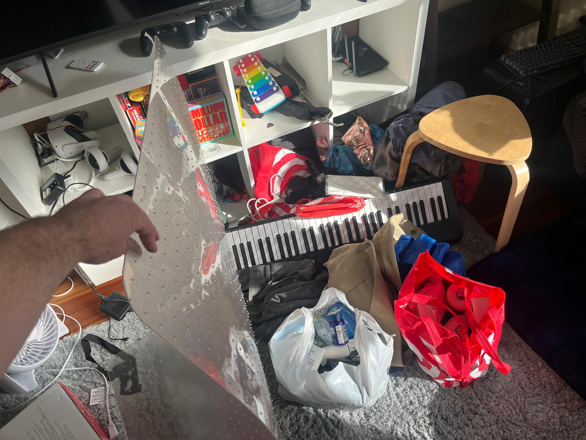
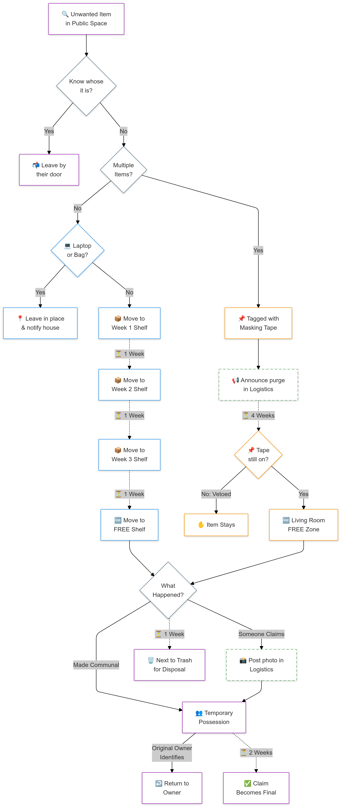

After spending four years in various communal living arrangements – from college dorms to organized independent student living groups of 28 people, to smaller apartment settings with around 8 people – I've gained significant insight into the logistics of shared living spaces. One of the most crucial aspects of maintaining harmony in these environments is having clear systems for managing private and communal property. In this article, I'll share a comprehensive approach that has worked well in my current living situation, which you might consider adapting for your own communal space.

## The Challenge of Shared Spaces

In any shared living environment, the line between private and communal property can quickly become blurred. Items get left in common areas, forgotten about, or abandoned entirely. Without clear systems in place, this leads to cluttered spaces, tension between housemates, and the occasional accidental use (or disposal) of someone else's belongings. The solution? A three-part system combining clear ownership marking, a structured lost and found process, and regular purging of abandoned items.

---

## 01 The Color-Coding System

The foundation of our property management system is remarkably simple: each resident is assigned a specific color of stickers, with purple designated for communal items. This creates an immediate visual language that everyone can understand. When you spot an item with a red sticker, you know it belongs to Sarah; a blue sticker means it's Michael's, and so on. Any item without a sticker is assumed to be communal, creating a default that encourages sharing while still allowing for clear private ownership when desired. (Note: initials may also be used, but tend to be harder to spot and may not be possible on all surfaces.)

There are, however, some clever exceptions to this rule. In our house, items in the communal pantry or on designated communal shelves are considered shared regardless of any stickers. This prevents the awkward situation of having to navigate around privately claimed items in obviously communal spaces while still allowing residents to track their contributions.

Teahouse ownership

## 02 The Lost & Found System

No matter how well-organized a house is, items will inevitably be left in common spaces. Our solution is a four-week lost and found system that provides structure while being fair to both the owners and the house as a whole. The system uses four shelves labeled with consecutive Fridays. Items found in common spaces are placed on the first shelf, and each week, someone volunteers to shift everything down one shelf. As a reward for maintaining the system, this person gets first pick of any items that reach the "free" shelf.

What makes this system particularly effective is its clear progression and built-in incentives. Laptops and bags are exempt and left in place with a house notification, acknowledging that some items are too valuable for the standard process. Meanwhile, the weekly shifting creates regular opportunities for items to be reclaimed while ensuring that truly abandoned items don't accumulate indefinitely.

## 03 The Purge System

Sometimes, more aggressive decluttering is needed, which is where our purge system comes into play. Any resident can initiate a purge by marking items with masking tape and notifying the house. The beauty of this system is its democratic nature – anyone can remove the tape to veto an item's removal, but items that remain tagged for four weeks enter the same final stages as lost and found items.

The purge system is particularly useful for addressing items that are technically claimed but haven't been used in ages, or communal items that have outlived their usefulness. By using masking tape instead of immediately removing items, it creates a buffer period for discussion and consideration.

Items marked for purging w/ masking tape

Collected purge items prior to disposal or donation

Lost & Found + Purge Diagram

## 04 Making It Work Together

The real magic happens when these three systems work in concert. The color coding creates clear ownership, the lost and found provides a structured process for misplaced items, and the purge system offers a mechanism for addressing long-term accumulation. Together, they create a comprehensive approach to property management that's both fair and efficient.

What's particularly interesting is how these systems naturally encourage different behaviors. The color coding makes people more mindful about where they leave their belongings. The lost and found creates a regular rhythm of checking for missing items. The purge system promotes periodic discussions about what the house really needs and uses.

---

## Implementation Tips

If you're considering implementing similar systems in your communal living space, start with the color coding – it's the easiest to implement and provides immediate benefits. From there, you can introduce the lost and found system, perhaps starting with just two shelves and expanding as needed. The purge system can be introduced last, once people are comfortable with the basic property management concepts.

Remember that these systems should serve as guidelines rather than strict rules. The goal is to create clear expectations and communication channels, not to create bureaucracy. Be prepared to adjust the systems based on your house's specific needs and culture.

## Final Thoughts

While these systems might seem elaborate on paper, they quickly become second nature in practice. The key is that they provide clear answers to common questions: "Whose is this?" (Check the sticker), "Where do I put this found item?" (First shelf of lost and found), "How do we deal with abandoned items?" (Initiate a purge).

The beauty of these systems is that they reduce the need for constant communication about property issues while still maintaining respect for both private and communal property. They create clear pathways for dealing with common situations while building in enough flexibility to handle edge cases. Most importantly, they help create a living environment where everyone can feel secure about their belongings while still maintaining the benefits of communal living.
